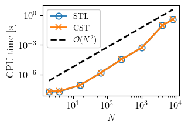
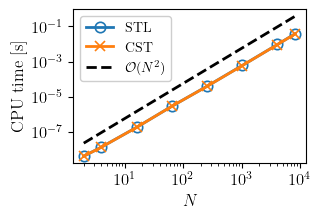
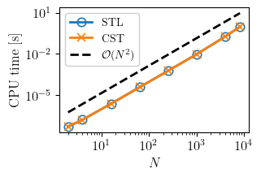
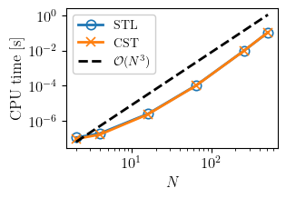
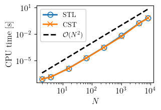
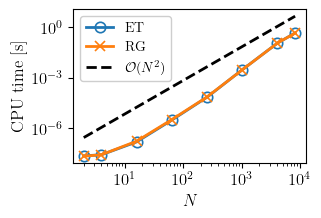
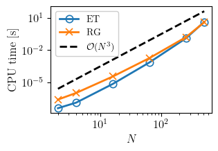
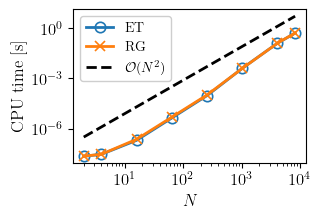
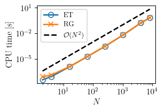

# C++ linear algebra playground

This repository implements a small linear algebra library in C++ with two distinct backends for performing operations on matrices and vectors. Both backends are designed to evaluate operations lazily, offering efficiency and flexibility.

## Goals of the Project

### 1. Refreshing C++ Skills
After spending a period working with Python, I wanted to refresh my C++ skills, focusing on modern and advanced techniques. This project utilizes features such as: ranges and views, concepts, expression templates, variadic templates and fold expressions, universal references, template template classes, among others.

### 2. Exploring Modern C++ Development Tools
The project also allowed me to refine my understanding and usage of modern development tools for C++: CMake, code coderage with lcov, unit testing with doctest, Ccache, github actions and containerization with Docker, precompiled headers.

### 3. Comparing Backends for Lazy Evaluation
The project sought to compare the efficiency of two backends designed for lazy evaluation of linear algebra operations:

- The **established expression templates approach**.
- The **modern ranges/views-based approach**.

### 4. Investigating Custom (CST) Containers vs STL Containers
Another key motivation was to explore whether a very simple user-implemented container could achieve the same level of efficiency as `std::vector`, the standard container for dynamic arrays in C++.

## Overview of the Backends

1. **Expression Templates Backend (ET)**
Implements linear algebra operations using the classic expression template approach.

2. **Ranges and Views Backend (RG)**
Leverages the modern C++ Ranges and Views library for lazy evaluation of operations.
   
In both backends the underlying container for storing matrix and vector coefficients is templetized. By default, ET uses `std::vector` and RG uses a custom container implemented from scratch. 

## Performance Comparison
This section presents the results of performance comparisons between the two backends. The analysis is divided into two parts.

### 1. **Comparison of Underlying Containers: STL VS CST**
Here, we evaluate the performance difference between `std::vector` (STL) and the custom-made (CST) container. To do so, we first consider matrices using the RG backend and `std::vector` as underlying container, and perform some simple memory acces and/or modify operations on the coefficients. We consider different matrix sizes ($N$) and measure CPU time. We denote these experiments STL. Then we perform the same experiments using again matrices using the RG backend but with the custom-made container. We denote these experiments CST.

In the following plots we denote: $A,B,C,D$ square matrices of size $N$; $s,r$ real numbers; $f(x)=x^2+1$ a function applied element-wise to the matrices coefficients.

<table align="center", border=0, style="width:100%">
  <tr>
    <td valign="top">
    

    
<em>Matrix deep copy: A=B.</em>
</td>
    <td valign="top">
    

    
<em>Access operator: A[i,j] for all i,j.</em>
</td>
    <td valign="top">
    

    
<em>Apply f(x) element-wise: f(A).</em>
</td>
  </tr>
</table>
<table align="center", border=0, style="width:100%">
  <tr>
    <td valign="top">
    

    
<em>LU factorization of A.</em>
</td>
    <td valign="top">
    

    
<em>Matrices multiplication: A@B@C@D.</em>
</td>
    <td valign="top">
    

    
<em>Perform element-wise: E = A * (s + B) + (C - r * A) / f(D).</em>
</td>
  </tr>
</table>

### 2. **Comparison of Backend Approaches: ET VS RG**
In this subsection, we focus on the difference in performance between the classic expression templates (ET) approach and the modern ranges/views (RG) approach. We perform some linear algebra expressions on matrices using the ET and RG backends and compare the CPU times. In both cases, the underlying container is `std::vector`.

<table align="center", border=0, style="width:100%">
  <tr>
    <td valign="top">
    

    
<em>Element-wise multiplication: A*B.</em>
</td>
    <td valign="top">
    

    
<em>Sum with scalar: A+s.</em>
</td>
    <td valign="top">
    

    
<em>Matrix multiplication of two expressions: (A * B + C * D) @ (B * C - D * A).</em>
</td>
  </tr>
</table>
<table align="center", border=0, style="width:66%">
  <tr>
    <td valign="top">
    

    
<em>Sum of four matrices: A+B+C+D.</em>
</td>
    <td valign="top">
    

    
<em>Perform element-wise: E = A * (s + B) + (C - r * A) / f(D).</em>
</td>
  </tr>
</table>
